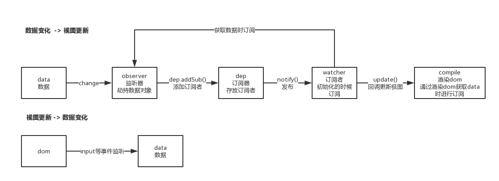

## 双向数据绑定
### 实现数据绑定做法
双向绑定主要就是在单向数据绑定的基础上对可输入的dom元素进行事件监听，主要实现方式有以下几种：

> 发布-订阅模式（backbone.js）
> 
> 脏值检查（angular.js） 
> 
> 数据劫持（vue.js）

**发布-订阅模式**: 一般通过sub, pub的方式实现数据和视图的绑定监听，更新数据方式通常做法是 vm.set('property', value)

我们更希望通过 vm.property = value 这种方式更新数据，同时自动更新视图，所以有了下面的两种方法

**脏值检查**:angular.js 是通过脏值检测的方式比对数据是否有变更，来决定是否更新视图，最简单的方式就是通过 setInterval() 定时轮询检测数据变动，angular只有在指定的事件触发时进入脏值检测，大致如下：

    - DOM事件，譬如用户输入文本，点击按钮等
    - XHR响应事件 ( $http )
    - 浏览器Location变更事件 ( $location )
    - Timer事件( $timeout , $interval )
    ..具体实现以后补充

**数据劫持**: Vue.js 则是采用数据劫持结合发布者-订阅者模式的方式，通过Object.defineProperty()(也可以是ES6的Proxy)来劫持各个属性的setter，getter，在数据变动时发布消息给订阅者，触发相应的监听回调。

### 流程图

双向数据绑定主要实现以下几个部分：
1. 数据监听器Observer: 劫持数据对象，当对象属性发生变化的时候,通过订阅器通知订阅者
2. 指令解析器Compile
    - 如果是模版渲染，则对每个元素节点的指令进行扫描和解析，根据指令模板替换数据，以及绑定相应的更新函数
    - 如果是渲染函数，则解析render函数渲染dom，并绑定相应的更新函数
    - 对dom节点做相应的事件监听，从而实现双向绑定
3. 订阅者Watcher： 实例进行订阅，并接受发布的通知来调用回调函数，从而更新模版
4. 订阅器Dep：存放订阅者，监听器Observer拦截到数据变化，从而触发订阅器的发布，进而触发订阅者的相应回调来更新dom
